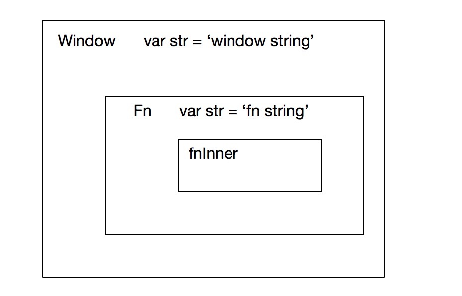

### 1. 什么是闭包？

> 闭包是有权访问另一个函数作用域中变量的函数。<p style="text-align:right">--- 来自《Javascript高级程序设计》</p>


> 当一个函数可以记住并访问所在词法作用域时，就产生了闭包，即使函数是在当前词法作用域之外执行<p style="text-align:right">--- 来自《你不知道的Javascript(上卷)》</p>

很难理解？没关系我们写一段代码来看什么是闭包。

```
var str = 'window string';
function fn() {
    var str = 'fn string';
    
    return function fnInner() {
        console.log(str)
    }
}

var result = fn();
result(); // result 最后执行结果是什么呢？

```
fn 在执行中把内部定义的函数fnInner作为结果返回到了外层并赋值给了result，result再去执行这个函数。<br/>

先不管结果如何，看这段代码str的值无外乎只有两种可能：
1. 在执行时确认，fnInner已经赋值给了全局变量result，应该在全局查找str，结果'window string'。
2. 在定义时确认，fnInner是在fn函数内定义的，应该在fn内部查找str，结果'fn string'。


那么Javascript会以哪种方式执行呢？让我们运行一下代码，结果是：
```angular2html
// fn string
```

结果是'fn string'，在定义时我们已经确定了str的值，无论fnInner在哪儿执行str的值永远不会改变。<br/>

我会从两方面解释这个问题：
   1. 为什么获取的值永远不会改变？ --- 「词法作用域」。
   2. 获取值的规则是什么？ --- 「作用域链」

#### 1.1 词法作用域

> Javascript 通常被归为 "动态" 或 "解释执行" 语言，但实际上Javascript是一门编译语言。<br/>
Javascript 代码块在真正执行前都要进行编译，又因为Javascript"动态"的这个特性，编译通过通常就在执行前，在Javascript编译器已经准备好一切之后，引擎就会立即执行它。<br/>


而词法作用域就是在代码编译过程中产生的，作用域的产生只与代码写在哪儿有关，与代码在哪儿执行毫无关系，上面的例子中的作用域可以画成图：


fnInner想要查找str的时候首先会在自己的作用域中查找，如果没有会去上一级作用域也就是fn去查找，在fn中找到str则会使用这个值。

##### 1.1.1 块级作用域 & 函数作用域

首先，作用域的用途是什么？<br/>

作用域应该是能以特殊的方式（变量对象）保存作用域中的变量和函数，只能通过作用域链规则来访问这些变量和参数，不能随意访问。

那么Javascript中存在块级作用域吗？写个例子验证一下
```javascript 1.5

for(var i = 0; i < 5; i++) {
    // do something
}

console.log(i);  // 打印出来的值是什么呢？
```
如果存在块级作用域的话，那么作用图应该是这样的


根据图展示的情况for生成了自己的作用域，在全局中无法查找到i这个值，console.log(i) 应该抛出"i is not define"的错误。
而真是的结果呢？<br/>

```javascript 1.5
// 5
```
我们竟然可以打印出i的值


