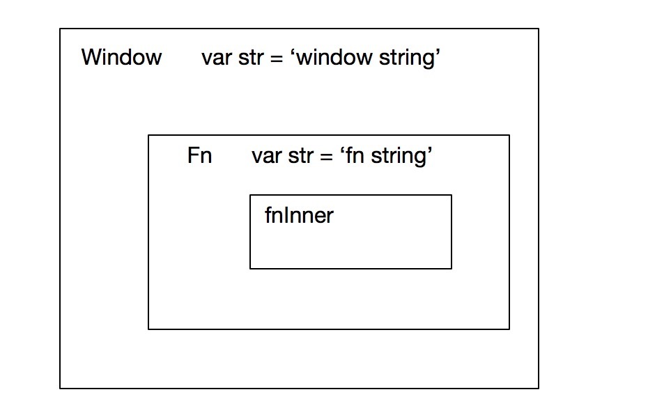
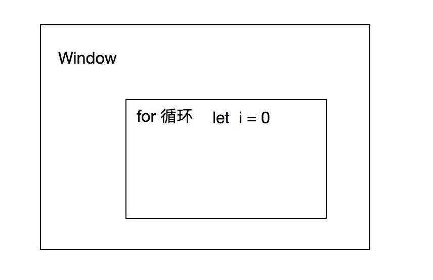

### 1. 什么是闭包？

> 闭包是有权访问另一个函数作用域中变量的函数。<p style="text-align:right">--- 来自《Javascript高级程序设计》</p>


> 当一个函数可以记住并访问所在词法作用域时，就产生了闭包，即使函数是在当前词法作用域之外执行<p style="text-align:right">--- 来自《你不知道的Javascript(上卷)》</p>

很难理解？没关系我们写一段代码来看什么是闭包。

```
var str = 'window string';
function fn() {
    var str = 'fn string';
    
    return function fnInner() {
        console.log(str)
    }
}

var result = fn();
result(); // result 最后执行结果是什么呢？

```
fn 在执行中把内部定义的函数fnInner作为结果返回到了外层并赋值给了result，result再去执行这个函数。<br/>

先不管结果如何，看这段代码str的值无外乎只有两种可能：
1. 在执行时确认，fnInner已经赋值给了全局变量result，应该在全局查找str，结果'window string'。
2. 在定义时确认，fnInner是在fn函数内定义的，应该在fn内部查找str，结果'fn string'。


那么Javascript会以哪种方式执行呢？让我们运行一下代码，结果是：
```angular2html
// fn string
```

结果是'fn string'，在定义时我们已经确定了str的值，无论fnInner在哪儿执行str的值永远不会改变。<br/>

我会从两方面解释这个问题：
   1. 为什么获取的值永远不会改变？ --- 「词法作用域」。
   2. 获取值的规则是什么？ --- 「作用域链」

#### 1.1 词法作用域

> Javascript 通常被归为 "动态" 或 "解释执行" 语言，但实际上Javascript是一门编译语言。<br/>
Javascript 代码块在真正执行前都要进行编译，又因为Javascript"动态"的这个特性，编译通常就在执行前，在Javascript编译器已经准备好一切之后，引擎就会立即执行它。<br/>


而词法作用域就是在代码编译过程中产生的，作用域的产生只与代码写在哪儿有关，与代码在哪儿执行毫无关系，上面的例子中的作用域可以画成图：


fnInner想要查找str的时候首先会在自己的作用域中查找，如果没有会去上一级作用域也就是fn去查找，在fn中找到str则会使用这个值。

##### 1.1.1 块级作用域 & 函数作用域

首先，作用域的用途是什么？<br/>

作用域应该是能以特殊的方式（变量对象）保存作用域中的变量和函数，只能通过作用域链规则来访问这些变量和参数，不能随意访问。

那么Javascript中存在块级作用域吗？写个例子验证一下
```javascript 1.5

for(var i = 0; i < 5; i++) {
    // do something
}

console.log(i);  // 打印出来的值是什么呢？
```
如果存在块级作用域的话，那么作用域图应该是这样的


如果根据图展示的情况for生成了自己的作用域，那么全局中应该无法查找到i这个值，console.log(i) 时会抛出"i is not define"的错误。
而真是的结果呢？<br/>

```javascript 1.5
// 5
```
我们竟然可以打印出i的值，所以可以证明Javascript中是不支持的块级作用域的。

ps：ES6中出现了另外两种声明变量的方式let、const他们只在自己的代码块中生效。


#### 1.2 作用域链
如果代码是这样的，结果会是什么呢？
```javascript 1.5
var str = 'window string';
function fn() {
    return function fnInner() {
        console.log(str)
    }
}

var result = fn();
result(); // result 最后执行结果是什么呢？

```

在作用域部分我们说过，全局和函数都会生成自己的作用域，并且作用域是嵌套的，函数作用域有权访问其包含的环境，包括全局作用域。<br/>
这种一层一层向上查找所依据的规则就是作用域链。

##### 1.2.1 通过代码从编译到执行来看作用域链是怎么生成的？
代码在真正执行前都会经过编译器编译成引擎可执行的代码，在执行过程中会执行两个操作：

- 创建变量对象：用于存放作用域中的变量和函数
- 函数内部属性[[scope]]：保存父变量对象的层级链（不是一个整的作用域链）

作用域中的值就存在「变量对象」中，此时的变量不在内存中无法访问。 <br/>

每个函数都会生成一个作用域，当函数执行时会被推入「环境栈」中，此时函数称为「执行环境（执行上下文）」，执行也分为两个操作：

1. 执行前：<br/>
    拿到函数内部的[[scope]]值复制一份创建作用域链。<br/>
    变量对象激活成为「活动对象」，活动对象上增加arguments，放入内存可以访问。<br/>
    将活动对象推入作用链顶端。<br/>
    确认this的指向。 <br/>
2. 执行时：<br/>
    随着函数执行修改「变量对象」上的值。
    
函数执行完之后会从环境栈中弹出，垃圾回收机制会对值进行相应的回收。

##### 1.2.2 解答自己的问题

1. 作用域和执行环境有什么区别？

个人理解：函数在编译阶段绑定变量对象的叫做作用域，每个函数在执行时推入到环境栈中后就叫做执行环境（执行上下文）。<br/>

2. 变量对象和活动对象有什么区别？

个人理解：变量对象是在编译时生成的他能访问，当函数进入环境栈变量对象激活就是活动对象<br/>
arguments函数是在函数执行时才会生成，所以活动对象应该包含变量对象。

3. 变量对象是在编译时候生成的吗？还是在执行前？

个人理解：我认为是在编译时生成的，第一点：用于闭包的父函数怎么能确认有变量被闭包引用不要回收掉？如果变量对象是在执行时生成而闭包又返回到函数体外，
代码就算是神仙也不知道有没有引用，要不要回收吧。第二点：有人会说变量对象如果编译生成的会占用内存？如果对象已经在内存中，就应该可以以某种方式访问到，
但是编译不执行的变量永远被访问不到，我认为变量对象应该是以特殊的方式存储的。


  
### 相关链接  
[活动对象与变量对象的区别？](https://www.zhihu.com/question/36393048)
[Javascript深入之闭包](https://github.com/mqyqingfeng/Blog/issues/9)  -- 这个有作用域链、闭包等一系列文章，值得看一下


